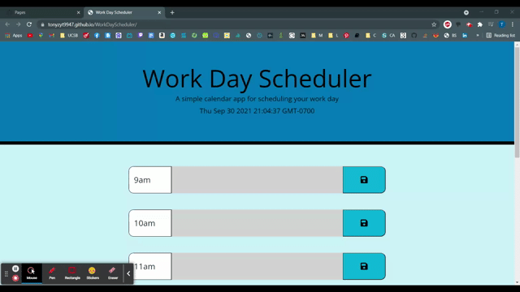

# Work Scheduler

This project aims to create a work day scheduler. The product should have a running clock displaying date and time in the header, and timeblocks for working hours that are color-coded into categories of past, present and future. The contents of each timeblock can be saved by clicking the save button.
​
## Getting Started
​
To open the deployed site, click [here](https://tonyzyt9947.github.io/WorkDayScheduler/).

To view the html code, open index.html.

To view the css code, open style.css.

To view the javascript code, open script.js.
​
 

### Prerequisites
​
The site should be able to run on any web browser.
 
### Installing

Click [here](https://www.google.com/chrome/) to install google chrome to open the site.

 

## Built With

* [HTML](https://developer.mozilla.org/en-US/docs/Web/HTML)
* [CSS](https://developer.mozilla.org/en-US/docs/Web/CSS)
* [Javascript](https://developer.mozilla.org/en-US/docs/Web/Javascript)
  
## Deployed Link

* [See Live Site](https://tonyzyt9947.github.io/Code-Quiz/)
​
​  
## Application Features and Code

View javascript comments.

## Demonstration

## Authors

* **Tony Zhang** 
- [Link to Portfolio Site](https://tonyzyt9947.github.io/PersonalPortfolio/)
- [Link to Github](https://github.com/Tonyzyt9947)
- [Link to LinkedIn](https://www.linkedin.com/in/tony-zhang-61670421b/)
​
  

## License
​
This project is licensed under the MIT License 
​
  
## Acknowledgments
* Lighthouse chrome extension. [Link](https://developers.google.com/web/tools/lighthouse)